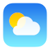

#  Weather 

Android weather app

 

## Geocoder
If you are using a custom version of Android without Google apps, you
may find the app does not work, with a pop-up message `No
geocoder`. You may fix this by installing
[GmsCore](https://github.com/microg/GmsCore) and
[NominatimGeocoderBackend](https://github.com/microg/NominatimGeocoderBackend),
and possibly [Local GSM
Location](https://gitlab.com/deveee/Local-GSM-Backend).
